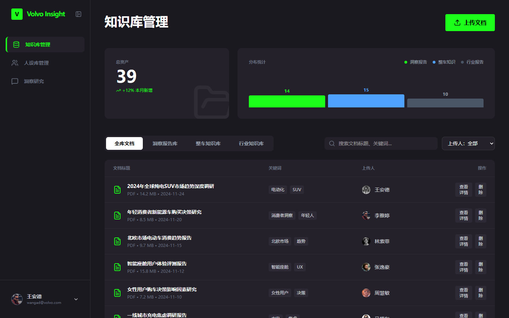
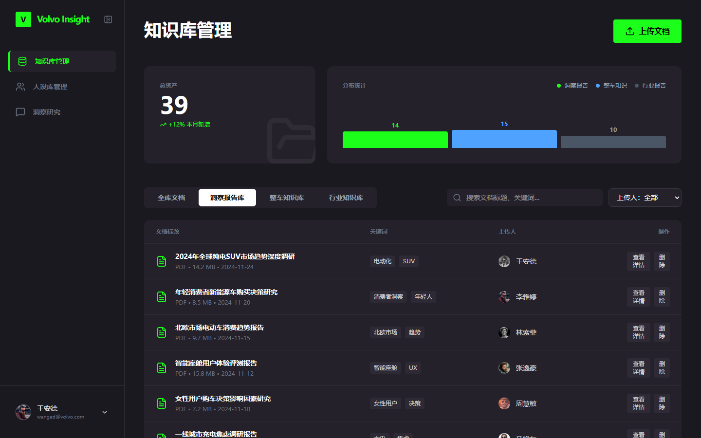
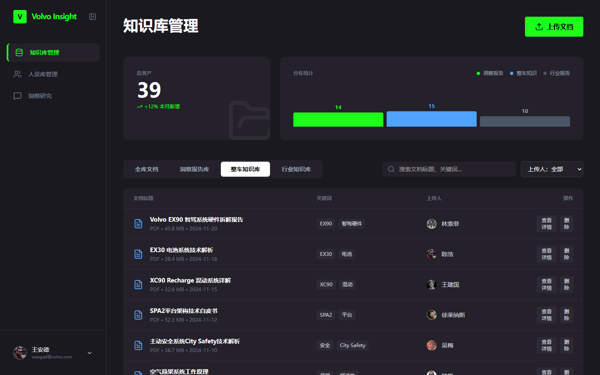
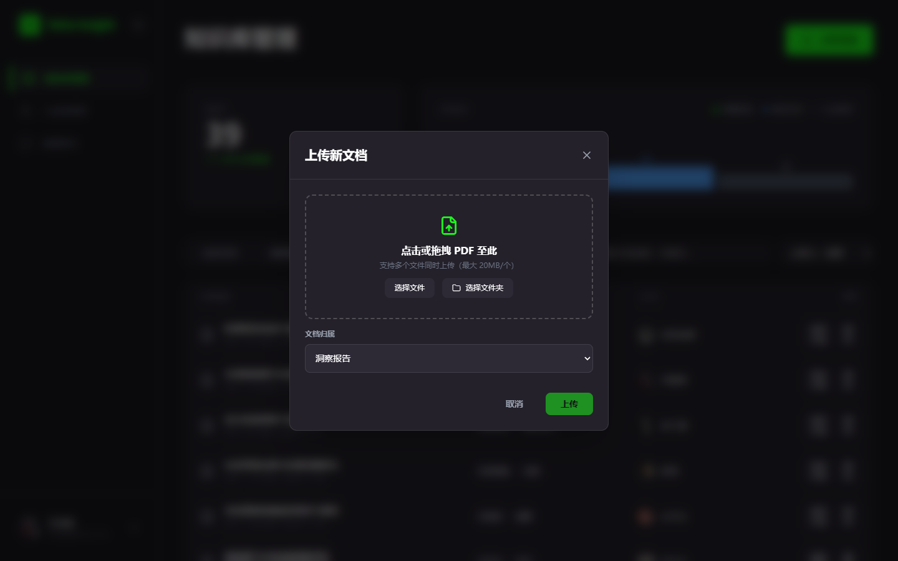
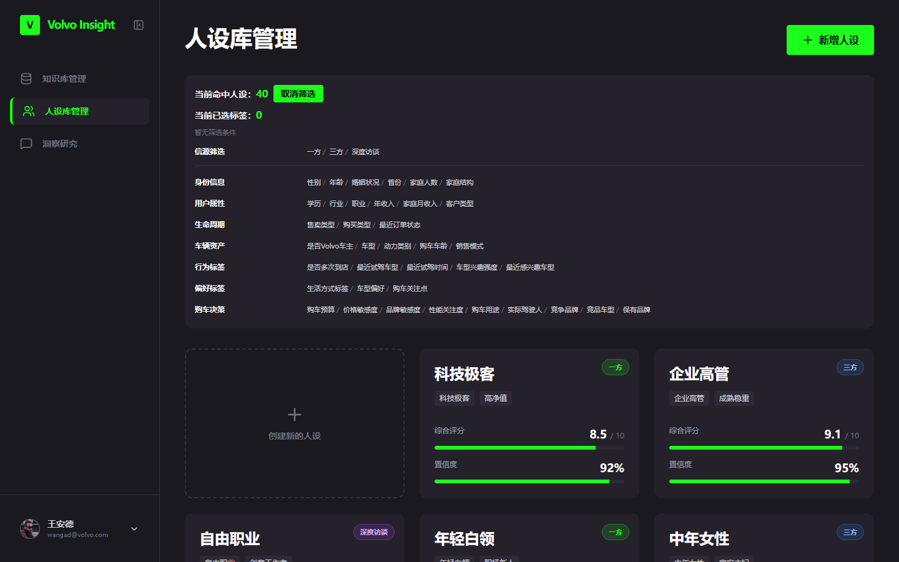
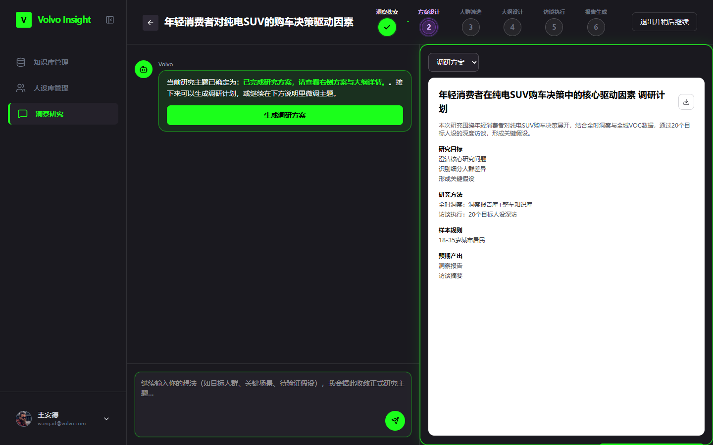
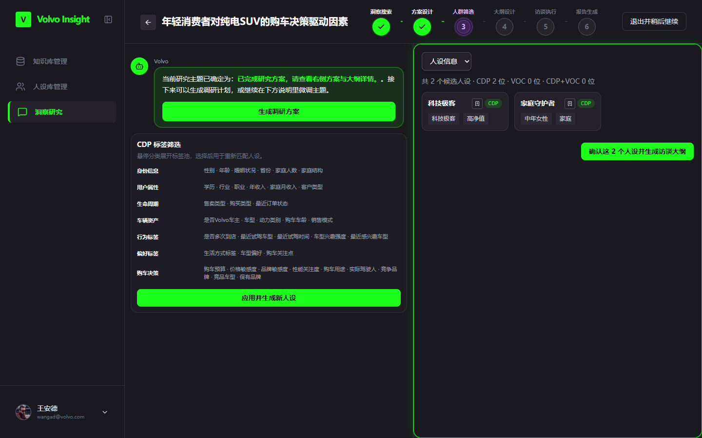
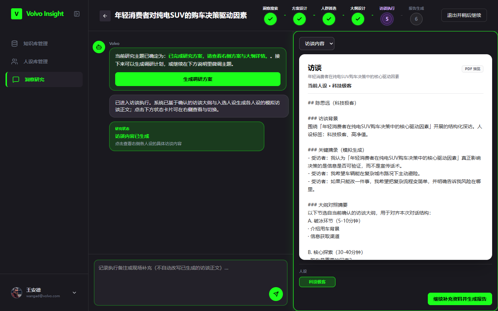
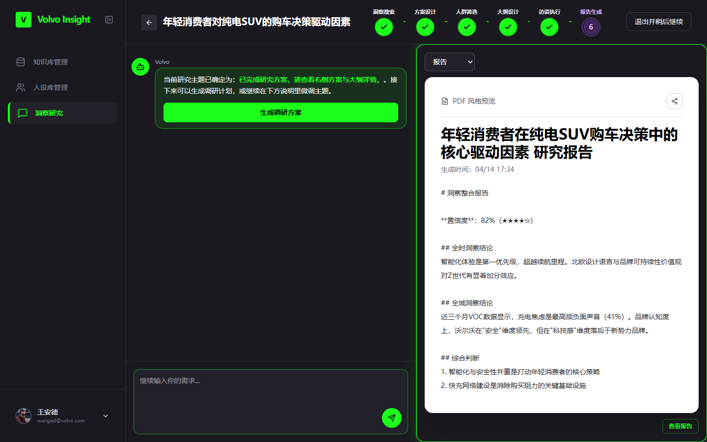

# 沃尔沃客户洞察智能体 MVP — 产品需求文档（PRD）

**文档版本：** v1.0  
**撰写日期：** 2026-04-14  
**产品名称：** Volvo Insight — 客户洞察智能体  
**文档范围：** MVP 阶段 Q2 交付范围  

---

## 目录

1. [背景与客户需求](#一背景与客户需求)
2. [MVP 功能范围（来自 BRD）](#二mvp-功能范围)
3. [功能架构总览：标品 vs 定开](#三功能架构总览标品-vs-定开)
4. [定开需求详细说明](#四定开需求详细说明)
   - 4.1 [知识库管理（完全定开）](#41-知识库管理完全定开)
   - 4.2 [人设库管理（标品 + 定开）](#42-人设库管理标品--定开)
   - 4.3 [洞察研究（标品 + 定开）](#43-洞察研究标品--定开)
5. [权限体系](#五权限体系)
6. [非功能性需求](#六非功能性需求)

---

## 一、背景与客户需求

### 1.1 项目背景

沃尔沃中国研究团队长期面临以下痛点：

- **信息孤岛严重**：历史洞察报告、整车知识、行业研究散落在不同系统，检索效率低；
- **用研流程割裂**：从研究课题到访谈大纲、人群筛选、报告产出，各环节缺乏系统性串联；
- **人设复用率低**：消费者画像多为一次性使用，无法基于 CDP/VOC 数据持续迭代；
- **洞察资产沉淀不足**：研究结论停留在 PPT，难以作为结构化知识复用。

为此，沃尔沃与我方合作启动「客户洞察智能体 MVP」定制开发项目，旨在以 AI 驱动的方式，将知识管理、人群画像、研究设计与报告生成整合为一个统一平台。

### 1.2 客户核心诉求（来自 BRD）

| 编号 | 业务诉求 | 对应 BRD 步骤 |
|------|---------|--------------|
| N-01 | 专家视角：查看某车型、某领域的全时/历史整合洞察认知 | Step 1 — 全时洞察 |
| N-02 | 客户视角：基于 VOC 数据库获取某车型、某领域的最新行为洞察 | Step 1 — 全域洞察 |
| N-03 | 方法匹配：定性与定量组合设计、样本分层策略与问卷提纲生成 | Step 2 — 研究方案设计 |
| N-04 | 对接 CDP，精准筛选目标人群，支持定量/定性/数字孪生调研 | Step 2 — 目标人群选择 |
| N-05 | 基于目标智能生成问卷与提纲，并自动去偏、逻辑校验、语义优化 | Step 2 — 研究内容生成 |
| N-06 | 通过数字人设进行虚拟验证，产出"预期反馈图谱" | Step 3 — 数字孪生虚拟验证 |
| N-07 | 聚合虚拟与现实多源数据，形成统一洞察报告（含置信度） | Step 3 — 融合调研结果 |
| N-08 | 最终报告自动生成，并归档入知识库，更新企业级客户认知地图 | Step 5 — 洞察资产沉淀 |

### 1.3 MVP 交付边界

- **包含**：知识库管理、人设库管理、洞察研究（含全时/全域洞察、方案设计、人群筛选、访谈执行、报告生成、资产归档）
- **不包含（MVP 阶段）**：Step 4 — 洞察转化行动（Translation into Actions）
- **后续迭代**：权限精细化管控（研究报告发布授权）、CDP/VOC 真实接口对接（当前为 Mock 数据）

---

## 二、MVP 功能范围

以下为 BRD Q2 阶段已确认纳入 MVP 的全部功能点：

| BRD 编号 | 功能名称 | BRD 状态 | 实现类型 |
|---------|---------|---------|---------|
| 1.1 | InsightHub：全时洞察 | ✓ 已包含 | 定开 |
| 1.2 | InsightHub：全域洞察 | ✓ 已包含 | 定开 |
| 2.1 | 研究方案设计 | ✓ 已包含（Must Have） | 标品为主 |
| 2.2 | 研究目标人群选择 | ✓ 已包含（Must Have） | 标品 + 定开（CDP 对接） |
| 2.3 | 研究内容生成 | ✓ 已包含（Must Have） | 标品为主 |
| 3.1 | 数字孪生虚拟验证 | ✓ 已包含 | 定制页面 + 标品底层能力 |
| 3.3 | 融合线上/虚拟调研结果 | ✓ 已包含 | 定制页面 |
| 3.5 | 全量报告生成 | ✓ 已包含（Must Have） | 定制页面 + 标品底层能力 |
| 5.1 | 洞察资产沉淀 | ✓ 已包含（Must Have） | 定制页面 |

---

## 三、功能架构总览：标品 vs 定开

### 3.1 模块对照表

| 模块名称 | 开发类型 | 说明 |
|---------|---------|------|
| **AI Panel**（对话面板） | **纯标品** | 保留原产品标品能力，沃尔沃直接使用，无定制 |
| **知识库管理** | **完全定开** | RAG 架构三分类知识库，支持 PDF 上传、检索、文档详情展示 |
| **人设库管理** | **标品 + 定开** | 在原 AI Persona 标品能力基础上，基于沃尔沃 CDP/VOC 数据重建人设体系，定制 7 维雷达图与标签分类 |
| **洞察研究** | **标品 + 定开** | 原 AI Research + AI Interview 能力集成；定制 6 阶段研究流程、全时/全域洞察选择、数字孪生访谈、融合报告 |

### 3.2 整体功能架构图

```
┌─────────────────────────────────────────────────────────────┐
│                    Volvo Insight 平台                        │
├────────────────┬────────────────┬───────────────────────────┤
│  AI Panel      │  知识库管理     │       洞察研究              │
│  （标品）       │  （完全定开）   │     （标品 + 定开）          │
│                │                │                            │
│  · 专家问答    │  · 洞察报告库   │  Stage 1：意图澄清          │
│  · 知识库检索  │  · 整车知识库   │  Stage 2：洞察源选择        │
│  · 联网搜索    │  · 行业知识库   │  Stage 3：主题探索确认      │
│                │                │  Stage 4：方案与大纲设计    │
│                ├────────────────┤  Stage 5：人群筛选          │
│                │  人设库管理     │  Stage 6：报告生成与归档    │
│                │  （标品+定开）  │                            │
│                │                │                            │
│                │  · CDP 标签筛选 │  ← 引用人设库              │
│                │  · 7 维雷达图  │  ← 引用知识库              │
│                │  · VOC 声音    │  ← AI Panel 底层能力       │
│                │  · 人设对话    │                            │
└────────────────┴────────────────┴───────────────────────────┘
```

### 3.3 核心数据流说明

洞察研究是整个平台的主轴，知识库与人设库作为输入源：

- **知识库 → 洞察研究**：研究员在"全时洞察"阶段可选择引用洞察报告库、整车知识库、行业知识库作为 AI 的知识范围
- **人设库 → 洞察研究**：在"人群筛选"阶段，从人设库中按 CDP 标签筛选目标人设，用于后续数字孪生访谈
- **洞察研究 → 知识库**：研究完成后，生成的报告经审核后归档入知识库，持续积累企业洞察资产

---

## 四、定开需求详细说明

---

### 4.1 知识库管理（完全定开）

#### 背景说明

对应 BRD 1.1 InsightHub：全时洞察的知识源管理需求。知识库采用 RAG（检索增强生成）架构，支持 PDF 上传与向量化检索，为 AI Panel 和洞察研究提供知识支撑。

三类知识库来源：
- **洞察报告库**：手动上传的历史调研报告 PDF + 洞察研究完成后归档的报告
- **整车知识库**：车型配置、车辆功能使用文档（辅助说明作用）
- **行业知识库**：商业报告 PDF、宏观政策法规、市场数据、竞品价格参数等

#### 页面结构

页面分为两个区域：

**上方统计区（Dashboard）**
- 左侧卡片：展示总资产数量（当前文档总数）及本月新增占比（如 +12%）
- 右侧卡片：展示三类知识库的文档数量分布，以色块柱状图形式呈现
  - 洞察报告库：亮绿色（lime）
  - 整车知识库：蓝色（blue-400）
  - 行业知识库：灰色（gray-600）

**下方文档区**

分类导航栏 + 筛选 + 文档列表三层结构：

```
[ 全库文档 ]  [ 洞察报告库 ]  [ 整车知识库 ]  [ 行业知识库 ]   [搜索框]  [上传者筛选▼]  [上传文档 按钮]

文档标题             关键词标签          上传者           操作
──────────────────────────────────────────────────────────────
📄 2024年全球纯电SUV市场趋势...  电动化  SUV    王安德 👤    [查看详情] [删除]
   PDF • 14.2 MB • 2024-11-24
──────────────────────────────────────────────────────────────
📄 年轻消费者新能源车购买决策...  消费者洞察  年轻人  李雅婷 👤  [查看详情] [删除]
```





#### 交互说明

**① 分类筛选**

| 操作 | 交互结果 |
|------|---------|
| 点击「全库文档」 | 展示所有三类文档，按上传时间倒序排列 |
| 点击「洞察报告库」 | 仅展示该分类下的文档，分类按钮高亮（白底） |
| 点击「整车知识库」 | 仅展示整车相关文档 |
| 点击「行业知识库」 | 仅展示行业报告文档 |



**② 搜索与筛选**

- **搜索框**：支持对文档标题和关键词标签进行实时全文模糊搜索（不区分大小写）
- **上传者下拉**：动态列出所有曾上传文档的人员，选择后仅展示该人员的文档
- 两个筛选条件同时生效（AND 逻辑）
- 无匹配结果时展示「暂无匹配的文档」空态提示

**③ 上传文档**

点击右上角「上传文档」按钮，弹出上传 Modal：

```
┌──────────────────────────────────────────────────┐
│  上传文档                                    [×]  │
│                                                    │
│  ┌──────────────────────────────────────────────┐ │
│  │                                              │ │
│  │   📤 拖拽文件到此处，或点击选择文件           │ │
│  │                                              │ │
│  │   [ 选择文件 ]    [ 📁 选择文件夹 ]           │ │
│  └──────────────────────────────────────────────┘ │
│                                                    │
│  已选择 2 个文件                    [清空]         │
│  📄 报告A.pdf          14.2 MB  [×]               │
│  📄 市场分析2024.pdf    8.5 MB  [×]               │
│                                                    │
│  归档分类：[ 洞察报告库 ▼ ]                        │
│                                                    │
│                 [ 取消 ]  [ 确认上传 ]             │
└──────────────────────────────────────────────────┘
```

| 规则 | 说明 |
|------|------|
| 文件格式 | 仅支持 PDF（`application/pdf`） |
| 单文件大小上限 | 20 MB |
| 批量上传 | 支持一次选择多文件或整个文件夹 |
| 不合规文件处理 | 在文件选择阶段即时提示格式错误或超大文件，不进入队列 |
| 归档分类选择 | 支持选择三类知识库之一，默认「洞察报告库」 |


**④ 文档详情**

点击文档行中的「查看详情」，进入文档详情页（单页替换，不弹窗）：

```
← 返回文档列表                                [分享] [下载] [删除]

📄  2024年全球纯电SUV市场趋势深度调研
    📅 2024-11-24   👤 王安德   📁 14.2 MB   🗂 洞察报告库
    🏷 电动化  SUV

    ▌ 文档摘要
    本报告深入分析了2024年全球纯电SUV市场的发展趋势，涵盖市场规模、
    消费者偏好、技术创新和竞争格局...

    ─────────────────────────────────────────────────────
    一、研究背景
    ...（文档正文内容展示）
    
    二、核心发现
    • ...
    
    三、数据分析
    ┌────────┬────────┬────────┐
    │  85%   │  72%   │  68%   │
    └────────┴────────┴────────┘
```


| 操作 | 说明 |
|------|------|
| 「返回文档列表」 | 回到知识库主页，保留当前分类和筛选条件 |
| 「下载」 | 触发 PDF 文件下载 |
| 「删除」 | 弹出确认对话框，确认后从知识库删除该文档 |
| 「分享」 | 复制文档链接（当前版本为 UI 占位，后续迭代实现） |

---

### 4.2 人设库管理（标品 + 定开）

#### 背景说明

**标品能力**：AI Persona — 基于 LLM 构建用户画像、支持 PDF 上传自动生成人设、与人设进行对话深化研究。

**定开内容**：在标品底层能力基础上，使用沃尔沃 CDP/VOC 数据重建人设体系，具体定制包括：
1. 沃尔沃专属 CDP 标签分类体系（7 大类、40+ 标签字段）
2. 汽车消费者专属 7 维雷达图维度定义
3. 40 个基于真实 CDP 数据构建的沃尔沃典型消费者人设
4. 三类数据来源标注体系（一方 / 三方 / 深度访谈）

#### 页面结构



页面分为上下两层：

**上层：CDP 标签筛选面板**

```
信源：  [● 一方]  [○ 三方]  [○ 深度访谈]

身份信息   ▶  性别/年龄/婚姻状况/省份/家庭人数/家庭结构
用户属性   ▶  学历/行业/职业/年收入/家庭月收入/客户类型
生命周期   ▶  售卖类型/购买类型/最近订单状态
车辆资产   ▶  是否Volvo车主/车型/动力类别/购车车龄/销售模式
行为标签   ▶  是否多次到店/最近试驾车型/最近试驾时间/车型兴趣强度
偏好标签   ▶  生活方式标签/车型偏好/购车关注点
购车决策   ▶  购车预算/价格敏感度/品牌敏感度/性能关注度/购车用途/...
```

**下层：人设卡片网格（3 列）**

```
┌─────────────────┐  ┌─────────────────┐  ┌─────────────────┐
│          [一方]  │  │          [三方]  │  │         [深访]  │
│                  │  │                  │  │                  │
│  陈思远           │  │  李雅婷           │  │  张逸豪           │
│  科技极客  高净值  │  │  中年女性  家庭   │  │  都市先锋  Z世代  │
│                  │  │                  │  │                  │
│  综合评分  8.5/10 │  │  综合评分  8.6/10 │  │  综合评分  9.8/10 │
│  ████████░       │  │  ████████░       │  │  █████████░      │
│  置信度   92%    │  │  置信度   91%    │  │  置信度   98%    │
│  ████████░       │  │  ████████░       │  │  ██████████░     │
└─────────────────┘  └─────────────────┘  └─────────────────┘
```

人设卡片第一个位置为「新建人设」入口（虚线边框）。

#### CDP 标签体系详情

以下为沃尔沃专属 CDP 标签分类，共 7 大类：

| 大类 | 标签字段 | 可选值示例 |
|------|---------|---------|
| 身份信息 | 性别、年龄、婚姻状况、省份、家庭人数、家庭结构 | 男/女；18-25/26-35/36-45/46-60；北京/上海/广东... |
| 用户属性 | 学历、行业、职业、年收入、家庭月收入、客户类型 | 本科及以上；白领/体制内；10-30万；个人/企业 |
| 生命周期 | 售卖类型、购买类型、最近订单状态 | 新车/二手车；首购/增购/置换；已下单/已交车 |
| 车辆资产 | 是否Volvo车主、车型、动力类别、购车车龄、销售模式 | 是/否；XC40/XC60/XC90/S60/S90；燃油/混动/纯电 |
| 行为标签 | 是否多次到店、最近试驾车型、最近试驾时间、兴趣强度 | 是/否；XC60；最近7天/30天；高/中/低 |
| 偏好标签 | 生活方式标签、车型偏好、购车关注点 | 运动/旅行/家庭；SUV/轿车；安全/智能化/性价比 |
| 购车决策 | 预算、价格/品牌/性能敏感度、购车用途、竞争品牌 | 30-40万；高/中/低；通勤/家庭/商务；宝马/奔驰/奥迪 |

#### 交互说明

**① CDP 标签筛选**

| 操作 | 交互结果 |
|------|---------|
| 悬停某一大类行 | 展开该类的下拉标签面板，显示所有可选字段和选项 |
| 选择某标签值 | 人设卡片区实时过滤，只展示符合该标签的人设 |
| 多标签叠加选择 | AND 逻辑，同时满足所有已选标签的人设才展示 |
| 信源切换 | 按一方/三方/深度访谈单独筛选，或不限信源 |
| 分页 | 每页显示 10 个人设卡片，支持「上一页」/「下一页」翻页 |

**② 人设详情页**

点击任意人设卡片，进入该人设的详情页：

```
← 返回人设列表              陈思远 — 人设详情             信源：一方

CDP 标签：
[一线城市精英]  [智能驾驶偏好]  [高净值资产持有]  [纯电意向]  ...

典型声音（VOC）：
"我希望车辆能在复杂城市路况下主动避险，而不是只做被动提醒。"

关键词：[智能驾驶]  [安全]  [体验]  [主动]  [城市]  [避险]

七维画像雷达图：
                  人口与成长轨迹
                      78
           社会关系   /    \   心理动因
            66  ─────  ──── 90
                |    \/    |
           技术接受度   心理特征维度
            95  ─────  ──── 84
                       \  /
           行为维度 ─────────── 需求与痛点
               72                  88

                 [ 完善人设 → 进入对话 ]
```



**7 维雷达图维度说明：**

| 维度 | 含义 |
|------|------|
| 人口与成长轨迹 | 年龄/教育/城市与成长经历如何塑造价值观与选择偏好 |
| 心理动因 | 购买/使用背后的核心动机与触发点（安全感、效率、身份表达、家庭责任等） |
| 心理特征维度 | 风险偏好、控制感、理性/感性程度、对新事物的态度与决策风格 |
| 行为维度 | 信息搜集、比较决策、试驾/到店、分享/推荐等可观测行为模式 |
| 需求与痛点维度 | 明确诉求与真实痛点：空间/续航/充电/智能/舒适/成本等 |
| 技术接受度维度 | 对智能化、自动驾驶、互联服务的学习意愿、信任边界与付费意愿 |
| 社会关系维度 | 家庭/同伴/社群影响与口碑扩散路径，谁会影响其最终决定 |

**③ 完善人设（对话模式）**

点击「完善人设」，进入与该人设的一对一对话界面：

```
← 与「陈思远」对话            一对一人设智能对话

🤖 基于「陈思远」的人设信息，我建议从以下角度回答你的问题：
   1) 画像特征：科技极客、高净值
   2) 关键标签：一线城市精英、智能驾驶偏好、高净值资产持有
   3) 典型声音："我希望车辆能在复杂城市路况下主动避险..."
   如果你愿意，我可以继续把这个问题拆成可执行策略。

┌────────────────────────────────────────────────┐
│ 输入你的问题...                      [发送 →]  │
└────────────────────────────────────────────────┘
```

**④ 新建人设（PDF 上传生成）**

点击「新建人设」卡片，弹出上传 Modal：

| 步骤 | 说明 |
|------|------|
| 1. 上传文件 | 拖拽或选择 PDF 文件，单文件最大 20 MB，支持批量上传 |
| 2. 解析 | 系统使用 PDF.js 提取前 3 页文本（最多 1200 字） |
| 3. 生成 | AI 根据文档内容自动生成人设基础信息（名称、标签、VOC 摘要、雷达得分） |
| 4. 入库 | 生成的人设默认进入「待补充画像」状态，可在详情页继续完善 |

---

### 4.3 洞察研究（标品 + 定开）

#### 背景说明

**标品能力**：AI Research（研究分类、研究方案生成）+ AI Interview（访谈大纲生成、虚拟访谈执行）

**定开内容**：
1. 定制 6 阶段研究流程，串联全时/全域洞察、方案设计、人群筛选、大纲设计、访谈执行、报告归档
2. 沃尔沃汽车消费研究的 AI 自动分类配置（6 种研究类型 + 4 种分析框架）
3. 与知识库的深度集成（全时洞察阶段引用三类知识库）
4. 与人设库的深度集成（人群筛选阶段调用 CDP 标签筛选人设）
5. 定制研究报告模板（含置信度评级）与报告归档流程

#### 页面结构


洞察研究页面为双栏布局：

**左侧**：历史研究项目列表，支持按研究阶段状态筛选（洞察搜索 / 方案设计 / 人群筛选 / 大纲设计 / 访谈执行 / 未发布 / 已发布）

**右侧/主区**：当前研究项目的对话界面 + 功能操作区

新建研究时，在主区展示研究问题输入框（支持文字和语音）。

#### 完整研究流程（6 阶段）

```
[输入研究问题]
       ↓
Stage 1：意图澄清（全时/全域洞察源选择）
       ↓
Stage 2：主题探索与确认
       ↓
Stage 3：方案与访谈大纲设计
       ↓
Stage 4：目标人群筛选
       ↓
Stage 5：虚拟访谈执行
       ↓
Stage 6：报告生成 → 归档入知识库
```

---

#### Stage 1：意图澄清 + 洞察源选择

**触发方式**：用户在主输入框输入研究问题（如"年轻消费者对纯电 SUV 的购车决策驱动因素"），点击发送。

**AI 自动研究分类**：系统在后台调用分类引擎，将研究问题自动归类为以下 6 种类型之一，并匹配最适合的分析框架：

| 研究类型 | 触发关键词示例 | 匹配分析框架 |
|---------|-------------|------------|
| 洞察型（insights） | 了解、发现、洞察、需求分析 | JTBD（工作理论） |
| 测试验证型（testing） | 比较、测试、验证、A/B | STP（市场定位） |
| 创意生成型（creation） | 设计、创意、头脑风暴、方案 | KANO 模型 |
| 策略规划型（planning） | 制定、规划、战略、策略 | 用户旅程地图 |
| 产品创新型（productRnD） | 创新、新产品、市场机会 | GE-麦肯锡矩阵 |
| 综合型（misc） | 多目标、综合 | JTBD |

**全时洞察源选择**：

AI 引导用户选择本次研究的知识来源：

```
🤖 请选择本次研究的全时洞察范围：

   知识库范围（可多选）：
   [✓] 洞察报告库    [✓] 整车知识库    [ ] 行业知识库
   
   联网搜索：[开启 ●] / [关闭]
   
   [跳过，不需要全时洞察]     [确认，进入全域洞察]
```

**全域洞察源选择**：

```
🤖 请选择全域洞察的数据来源：

   数据来源：
   (●) 一方（沃尔沃自有 CDP 数据）
   ( ) 一方 + 三方（自有 + 市场数据）
   
   时间范围：
   [ 全部 ]  [ 最近一周 ]  [ 最近一个月 ]  [最近一季度]  [最近半年]  [最近一年]
   
   [跳过]     [确认]
```


---

#### Stage 2：主题探索与确认

AI 根据研究意图 + 已选洞察源，自动生成 4 个建议研究主题：

```
🤖 基于你的研究意图，建议优先探索以下方向：

   1. 纯电SUV 相关用户的核心决策驱动与阻碍
   2. 纯电SUV 在不同细分人群中的优先研究议题
   3. 年轻消费者视角下的关键假设与验证路径
   4. 纯电SUV 可优先展开的访谈主题

   或者，你可以直接输入研究主题 ↓

[   输入自定义研究主题...                          ]
```

| 操作 | 交互结果 |
|------|---------|
| 选择 AI 建议的主题 | 主题确认，进入 Stage 3 |
| 输入自定义主题后发送 | 主题确认，进入 Stage 3 |
| 继续与 AI 对话迭代 | AI 根据反馈持续调整建议主题，最终由用户确认 |

---

#### Stage 3：方案与访谈大纲设计

主题确认后，AI 同步生成研究方案和访谈大纲，以三栏布局呈现：



```
┌─────────────────┬─────────────────┬──────────────────┐
│   研究方案        │   访谈大纲        │   目标人群         │
│                  │                  │                   │
│ 研究摘要：       │ A. 破冰环节       │ [→ 进入人群筛选]  │
│ 本次研究围绕...  │ （5-10 分钟）    │                   │
│                  │ · 背景介绍        │                   │
│ 研究目标：       │ · 信息渠道        │                   │
│ 1. 澄清核心研究  │                  │                   │
│    问题边界       │ B. 核心探索       │                   │
│ 2. 识别不同细分  │ （30-40 分钟）   │                   │
│    人群的差异     │ · 决策标准        │                   │
│ 3. 形成关键假设  │ · 阻碍因素        │                   │
│                  │ · 推荐理由        │                   │
│ 研究方法：       │                  │                   │
│ · 全时洞察引用   │ C. 深挖与收尾    │                   │
│ · 20 个人设深访  │ （10-15 分钟）   │                   │
│ · 综合报告输出   │ · 补充细节        │                   │
│                  │ · 理想体验一句话 │                   │
└─────────────────┴─────────────────┴──────────────────┘
```

**方案优化流程**：

用户可在对话框中对方案提出反馈，AI 基于反馈生成 3 个验证问题，确认修改方向后重新生成方案：

```
用户：这个方案太宽泛，请聚焦到30-40岁已婚女性

🤖 收到，请确认以下调整方向：
   Q1：是否加入竞品对比分析？  [是] [否]
   Q2：样本量是否需要扩大至 30 人以上？  [是] [否]
   Q3：访谈是否需要覆盖线上线下混合场景？  [是] [否]
```

---

#### Stage 4：目标人群筛选



页面右侧展开 CDP 标签筛选面板（与人设库管理中的筛选面板一致），研究员通过标签组合筛选目标人设：

| 操作 | 说明 |
|------|------|
| 选择 CDP 标签 | 动态过滤人设库，实时展示符合条件的人设数量 |
| 点击人设卡片查看详情 | 在弹层中展示该人设的 7 维雷达图、VOC 和 CDP 标签 |
| 勾选/取消某个人设 | 加入或移出本次研究的受访人设池 |
| 确认人设列表 | 选定的人设将作为 Stage 5 访谈执行的对象 |

---

#### Stage 5：访谈大纲设计 + 虚拟访谈执行

**访谈大纲确认**：

基于 Stage 3 生成的大纲，研究员可在此阶段对每个问题进行微调（修改措辞、调整顺序、增删问题）。

**虚拟访谈（数字孪生验证）**：

对应 BRD 3.1 数字孪生虚拟验证，系统模拟选定人设对访谈问题的回答：

```
受访人设：陈思远（科技极客 · 高净值 · 一方）

大纲问题 B1：你在做购车选择时最看重的标准是什么？

🤖 [模拟陈思远的回答]
   作为一个对科技非常感兴趣的用户，我最看重的是车辆的智能化程度和
   主动安全能力。续航其次，但快充网络的覆盖对我来说比续航里程更重要。
   品牌调性方面，沃尔沃的北欧简约设计和安全口碑很对我的胃口...

[下一个问题 →]    [查看全部受访人设的回答汇总]
```



---

#### Stage 6：报告生成与洞察归档

**报告自动生成**：

AI 整合全时洞察结论 + 全域洞察结论 + 虚拟访谈结果，生成结构化洞察报告：

```
┌────────────────────────────────────────────────────┐
│                   洞察整合报告                       │
│  项目：年轻消费者对纯电SUV的购车决策驱动因素          │
│  生成时间：2026-04-14 14:32    置信度：★★★★☆(82%) │
├────────────────────────────────────────────────────┤
│ 一、关联洞察主题                                     │
│     全时洞察范围：洞察报告库 + 整车知识库             │
│     全域洞察：一方 VOC 数据（最近3个月）             │
│                                                      │
│ 二、全时洞察结论                                     │
│     [基于知识库的专家视角摘要...]                    │
│                                                      │
│ 三、全域洞察结论                                     │
│     [基于 VOC 数据的用户行为洞察...]                 │
│                                                      │
│ 四、虚拟访谈综合结论                                 │
│     [基于数字孪生访谈的关键发现与假设验证...]        │
│                                                      │
│ 五、综合判断                                         │
│     1. 将专家判断与用户反馈交叉验证...               │
│     2. 优先关注高影响、高分歧的变量...               │
│                                                      │
│           [下载 PDF]    [提交审核]                   │
└────────────────────────────────────────────────────┘
```



**洞察资产归档流程**（对应 BRD 5.1）：

```
报告生成
   ↓
「提交审核」→ 报告状态变为「未发布」（仅 Owner 可见）
   ↓
Owner 审核通过 → 「发布」→ 报告状态变为「已发布」（所有人可见可引用）
   ↓
「归档」→ 报告自动进入知识库「洞察报告库」分类
          并更新企业级客户认知地图（洞察资产积累）
```

| 状态 | 可见范围 | 可引用 | 可编辑 |
|------|---------|-------|-------|
| 未发布 | 仅 Owner | 不可引用 | 仅 Owner 可删除 |
| 已发布 | 所有人 | 可引用 | 仅 Owner 可删除 |
| 已归档 | 所有人 | 可引用 | 不可修改，仅 Owner 可删除 |

---

## 五、权限体系

基于 BRD Section 4 权限体系设计：

| 资源类型 | 基础信息浏览 | 引入洞察/研究 | 查看详情 | 编辑/删除 |
|---------|-----------|------------|-------|---------|
| **研究报告（未发布）** | 仅 Owner | 不可引入 | 仅 Owner | 仅 Owner 可删除 |
| **研究报告（已发布 + 手动上传）** | 所有人 | 可引入 | 所有人（未来可能需授权） | 仅 Owner 可删除 |
| **行业报告库** | 所有人 | 可引入 | 所有人（未来可能需授权） | 仅 Owner 可删除 |
| **人设库** | 所有人 | 可引入 | 所有人 | 仅 Owner |

---

## 六、非功能性需求

| 类别 | 要求 |
|------|------|
| **性能** | 知识库搜索响应 < 2 秒；AI 流式输出首 Token < 3 秒 |
| **文件支持** | PDF 格式，单文件最大 20 MB |
| **AI 模型** | 默认使用 Step-3.5 Flash（OpenRouter 路由），可切换至 DeepSeek |
| **数据持久化** | MVP 阶段使用 LocalStorage 存储；生产阶段迁移至后端数据库 |
| **CDP/VOC 接口** | MVP 阶段为 Mock 数据；Q3 迭代中与沃尔沃 CDP/VOC 系统完成真实接口对接 |
| **浏览器兼容** | 支持 Chrome 120+、Edge 120+；1440px 以上分辨率最佳体验 |
| **安全** | 所有 API Key 通过环境变量注入，不在前端暴露 |

---

*文档结束 — 如有疑问请联系产品负责人*
